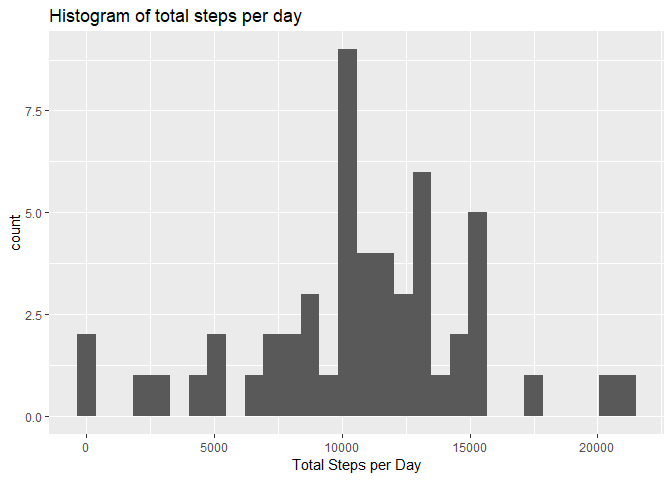

---
title: 'Reproducible'
output:
      html_document:
        keep_md: yes
--- 
## Data Wrangling:

```r
windowsFont("Lucida Console")
```

```
## [1] "Lucida Console"
```

### Session Information

```r
sessionInfo()
```

```
## R version 3.6.0 (2019-04-26)
## Platform: x86_64-w64-mingw32/x64 (64-bit)
## Running under: Windows 10 x64 (build 17134)
## 
## Matrix products: default
## 
## locale:
## [1] LC_COLLATE=English_United Kingdom.1252 
## [2] LC_CTYPE=English_United Kingdom.1252   
## [3] LC_MONETARY=English_United Kingdom.1252
## [4] LC_NUMERIC=C                           
## [5] LC_TIME=English_United Kingdom.1252    
## 
## attached base packages:
## [1] stats     graphics  grDevices utils     datasets  methods   base     
## 
## loaded via a namespace (and not attached):
##  [1] compiler_3.6.0  magrittr_1.5    tools_3.6.0     htmltools_0.3.6
##  [5] yaml_2.2.0      Rcpp_1.0.1      stringi_1.4.3   rmarkdown_1.13 
##  [9] knitr_1.23      stringr_1.4.0   xfun_0.7        digest_0.6.19  
## [13] evaluate_0.13
```

### Loading Essential Packages

```r
library(dplyr)
```

```
## 
## Attaching package: 'dplyr'
```

```
## The following objects are masked from 'package:stats':
## 
##     filter, lag
```

```
## The following objects are masked from 'package:base':
## 
##     intersect, setdiff, setequal, union
```

```r
library(ggplot2)
```

```
## Registered S3 methods overwritten by 'ggplot2':
##   method         from 
##   [.quosures     rlang
##   c.quosures     rlang
##   print.quosures rlang
```

```r
library(rmarkdown)
library(knitr)
```

### The Dataset

```r
activity = read.csv("activity.csv")
```
Here are the summary statistics of the dataset

```r
summary(activity)
```

```
##      steps                date          interval     
##  Min.   :  0.00   2012-10-01:  288   Min.   :   0.0  
##  1st Qu.:  0.00   2012-10-02:  288   1st Qu.: 588.8  
##  Median :  0.00   2012-10-03:  288   Median :1177.5  
##  Mean   : 37.38   2012-10-04:  288   Mean   :1177.5  
##  3rd Qu.: 12.00   2012-10-05:  288   3rd Qu.:1766.2  
##  Max.   :806.00   2012-10-06:  288   Max.   :2355.0  
##  NA's   :2304     (Other)   :15840
```

## Exploratory Data Analysis
### Numerical Summaries

```r
## Mean and Median number of steps taken each day by grouping daywise
steps_details <- activity %>%
  group_by(date) %>%
  summarise(steps_per_day = sum(steps, na.rm = FALSE), median_per_day = median(steps),
            mean_per_day = mean(steps))
head(steps_details)
```

```
## # A tibble: 6 x 4
##   date       steps_per_day median_per_day mean_per_day
##   <fct>              <int>          <dbl>        <dbl>
## 1 2012-10-01            NA             NA       NA    
## 2 2012-10-02           126              0        0.438
## 3 2012-10-03         11352              0       39.4  
## 4 2012-10-04         12116              0       42.1  
## 5 2012-10-05         13294              0       46.2  
## 6 2012-10-06         15420              0       53.5
```

### Plots

```r
## Plotting a Histogram
ggplot(mapping = aes(x = steps_details$steps_per_day))+
  geom_histogram()+ 
  ggtitle("Histogram of total steps per day")+
  xlab("Total Steps per Day") 
```

```
## `stat_bin()` using `bins = 30`. Pick better value with `binwidth`.
```

<!-- -->


```r
## Average steps during each time interval
# Grouping the variables on the basis of the interval
interval_details <- activity %>%
  group_by(interval) %>%
  summarise(mean_steps = mean(steps, na.rm = TRUE))

# Time series plot
ggplot(interval_details, mapping = aes(x=interval, y=mean_steps))+
  geom_line()+
  ggtitle("Time Series Plot of Steps Averaged over all days")+
  ylab("Steps Averaged over all days")
```

<!-- -->

Calculating the interval during which mean number of steps is the highest: 

```r
interval_details$interval[which.max(interval_details$mean_steps)]
```

```
## [1] 835
```

## Data Cleaning 

We first get a count of the missing values:

```r
lapply(activity, function(x) sum(is.na(x)))
```

```
## $steps
## [1] 2304
## 
## $date
## [1] 0
## 
## $interval
## [1] 0
```

### Imputing the missing Values:
Only 'steps' has missing values. Hence, replace them by the mean and store the analytic data in a new dataset - 'activity_ana'


```r
activity_ana <- activity
activity_ana$steps[is.na(activity_ana$steps)] <- 
  mean(activity_ana$steps, na.rm = TRUE)
```

### Plots

```r
## Mean and Median number of steps taken each day by grouping daywise
activity_ana%>%
  group_by(date) %>%
  summarise(steps_per_day = sum(steps)) %>%
  
  ggplot(steps_per_day, mapping = aes(x = steps_details$steps_per_day))+
  geom_histogram(binwidth = 1000)+
  ggtitle("Histogram of total steps per day")+
  xlab("Total Steps per Day") 
```

<!-- -->

## Are there differences in activity patterns between weekdays and weekends?

```r
# Creating the factor variable 'day_type'
weekdays1 <- c('Monday', 'Tuesday', 'Wednesday', 'Thursday', 'Friday')
activity_ana$day_type <- 
  factor((weekdays(as.Date(activity_ana$date)) %in% weekdays1), 
         levels=c(FALSE, TRUE), labels=c('weekend', 'weekday'))

# Boxplot to compare the steps during weekdays and weekends
ggplot(activity_ana, mapping = aes(x = day_type, y = log10(steps)))+
    geom_boxplot() +
    theme(axis.title.x = element_blank())
```

<!-- -->

**Narrative:**
- The number of steps is less variable during weekends
- The median number of steps is slightly more during weekends
